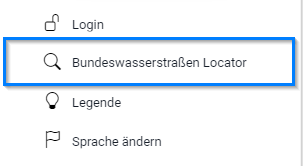
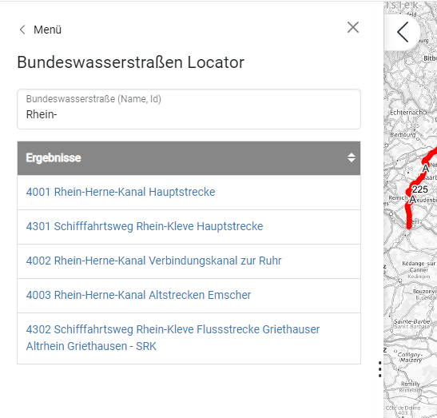
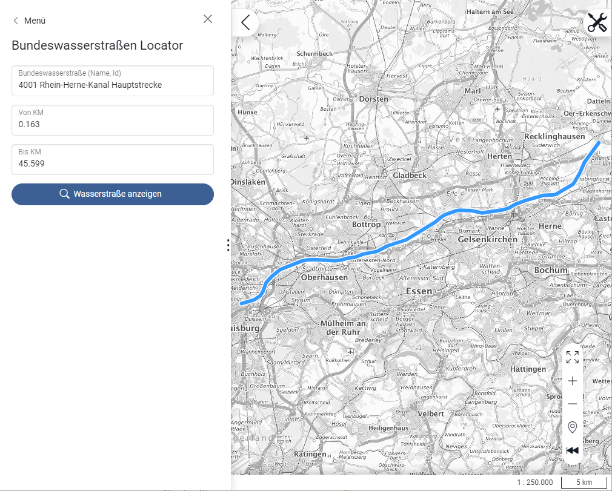

# BWaStr-Locator addon for Masterportal v3
[](https://opensource.org/licenses/MIT) 

This [Masterportal](https://www.masterportal.org/) addon provides a feature for searching german waterways and segments of waterways. The search is based on the service [BWaStr-Locator](https://via.bund.de/wsv/bwastr-locator).

## Prerequisites
This addon works with [Masterportal version 3](https://bitbucket.org/geowerkstatt-hamburg/masterportal/src/v3.0.0/).

## How to add this addon to your Masterportal configuration
1. Pull and copy addon code into the *addons* folder (./addons) of your Masterportal instance.
2. Activate addon by adding configuration sections in *addonsConf.json* and *config.js*.
3. Add addon as an item to Masterportal's tools menu by editing *config.json*.

For more information about using and developing addons see Masterportal's [developer documentation](https://bitbucket.org/geowerkstatt-hamburg/masterportal/src/fa0906d1c3d580dabbbe3d58b51ec9a14a923948/doc/devdoc.md)

### addonsConf.json
```
{
  "bWastrLocator": {
    "type": "tool"
  },
  ...
}
```

### config.js
```
const Config = {
  ...
  addons: ["bWaStrLocator", ...]
  ...
}
```

### config.json
```
{
  "portalConfig": {
    ...
    "mainMenu": {
      "sections": [
        [
          {
            "type": "bWaStrLocator",
            "wsQueryAPI": "https://via.bund.de/wsv/bwastr-locator/rest/bwastrinfo/query",
            "geocodingQueryAPI": "https://via.bund.de/wsv/bwastr-locator/rest/geokodierung/query",
            "wkId": 25833,
            "searchField": "all"
          },
          ...
        ]
      ]
    }
  }
}
```
#### Configuration parameter in config.json
| Parameter | Default | Description |
| ------- | ------- | ------- |
| wsQueryAPI | https://via.bund.de/wsv/bwastr-locator/rest/bwastrinfo/query | (String) URL of the public REST API of service BWaStr Locator (bwastrinfo) |
| geocodingQueryAPI | https://via.bund.de/wsv/bwastr-locator/rest/geokodierung/query | (String) URL of the public REST API of service BWaStr Locator (geocoding) |
| searchField | all | (String) Search field. Available values: "all" (default), "bwastrid", "bwastr_name", "strecken_name". For more information see [documentation of BWaStr-Locator-REST-API](https://www.google.com/search?q=Bundeswasserstra%C3%9Fen-Locator+REST). |
| wkId | 25832 | (Number) Spatial reference system (EPSG code) to use for displaying geometries (i.e. 25833)|


## How to use it
1. Select tool *Bundeswasserstraßen Locator* in Masterportal's menu.
2. Type in *name* or *id* of a waterway (i.e. "Rhein", "4001").
3. Select an entry from search results.
4. Adjust parameters *from-km* and *to-km* (optional). Use number format "123.45".
5. Click button "*Show waterway*" to display waterway/segment in the map.

## Features

### Menu item for BWaStr-Locator
After installation the addon is accessible by an item in one of Masterportal menus (main menu or tool menu).



### Search waterways
Searching german waterways and segments by *name*, *id* (id: Bundeswasserstraßen-Identnummer), *from-kilometer*, *to-kilometer*



### Geolocate waterways
Displaying waterways or segments in map (transformation from linear referenced waterways to geographic coordinates)


